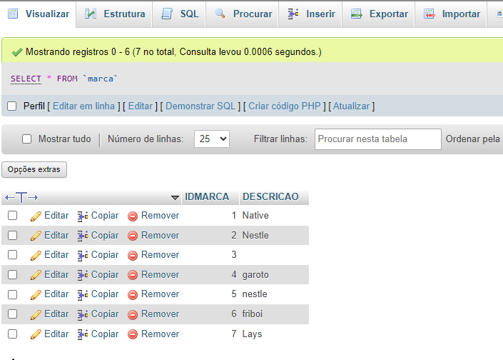

# CadEcommerce

[CadEcommerce](#cadecommerce)
[Descrição](#descri%C3%A7%C3%A3o)
[Introdução](#introdu%C3%A7%C3%A3o)
[Funcionalidades](#funcinalidades)
[Tecnologias utilizadas](#tecnologias-utilizadas)
[Fontes consultadas](#fontes-consultadas)
[Autores](#autores)

# Descrição
Os códigos fornecidos compõem uma aplicação web para gerenciamento de produtos e categorias em um sistema. A aplicação oferece funcionalidades para o cadastro de produtos, marcas e categorias, bem como para a exibição de resumos de pedidos. A seguir, é apresentada uma visão geral das principais partes da aplicação:
Esta página HTML e PHP permite aos usuários cadastrar novos produtos no sistema. A interface inclui um formulário onde os usuários inserem informações como nome, descrição, quantidade em estoque, preço, categoria e marca do produto. O formulário utiliza dropdowns para selecionar a categoria e a marca, que são preenchidos dinamicamente com dados existentes no banco de dados. Após o preenchimento, os dados são enviados para um script PHP (insere-produto.php) que processa a inserção do produto na tabela correspondente do banco de dados.
# Introdução
Esta página HTML e PHP permite aos usuários cadastrar novas marcas no sistema. A interface inclui um formulário simples onde os usuários podem inserir a descrição da nova marca. Quando o formulário é submetido, os dados são enviados para um script PHP (insere-marca.php), que processa uma nova marca no banco de dados.
A página também permite aos usuários cadastrar novas categorias de produtos no sistema. Isso inclui um formulário simples onde os usuários podem inserir a descrição da nova categoria. Quando o formulário é submetido, os dados são enviados para um script PHP (insere-categoria.php), que processa a inserção da nova categoria no banco de dados.
Os códigos fornecidos são partes de uma aplicação web para gerenciamento de produtos. A aplicação inclui funcionalidades para cadastro de novos produtos, marcas e categorias, além de exibir resumos de pedidos. Esta página HTML e PHP permite aos usuários cadastrar novos produtos no sistema. A interface inclui um formulário onde os usuários podem inserir:
nome do produto, descrição do produto, quantidade em estoque, preço do produto, categoria do produto, marca do produto. Quando o formulário é submetido, os dados são enviados para um script PHP (insere-produto.php), que processa a inserção do novo produto no banco de dados.

# Funcionalidades
A aplicação web fornecida tem várias funcionalidades essenciais para o gerenciamento de produtos e categorias. 
Cadastro de Produtos: Permite aos usuários adicionar novos produtos ao sistema.

Formulário de Cadastro: Os usuários preenchem informações sobre o produto, incluindo nome, descrição, quantidade em estoque, preço, categoria e marca.

Interação com o Banco de Dados: Quando o formulário é enviado, os dados são processados e inseridos na tabela produtos do banco de dados por meio de um script PHP (insere-produto.php).

Geração Dinâmica de Conteúdo: O script PHP (produtos-resumo.php) recupera as informações dos produtos e as exibe na página, oferecendo uma visão geral do pedido para o usuário.

Processamento de Dados: Recebe a descrição da marca do formulário e executa um comando SQL para inserir a marca na tabela marca.

Feedback ao Usuário: Exibe uma mensagem informando o sucesso ou a falha da operação de inserção.

Formulário de Cadastro: Os usuários inserem a descrição da nova categoria.

Processamento e Armazenamento: O script PHP (insere-categoria.php) processa a inserção da categoria na tabela categoria do banco de dados.
# Tecnologias utilizadas
- PHP
- HTML
- MYSQL
- CSS
# Fontes consultadas
- [Leonardo](https://github.com/LeonardoRochaMarista/LeonardoRochaMarista)
- [ChatGPT](https://chatgpt.com/)
# Autores
- [Gabriella](https://github.com/gaabriellasantoos)
- [Leonardo](https://github.com/LeonardoRochaMarista/LeonardoRochaMarista)
